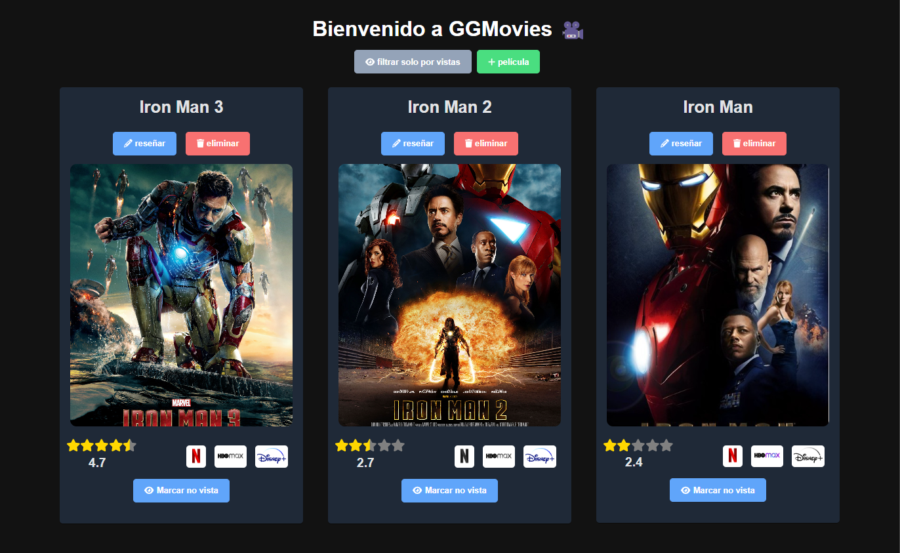
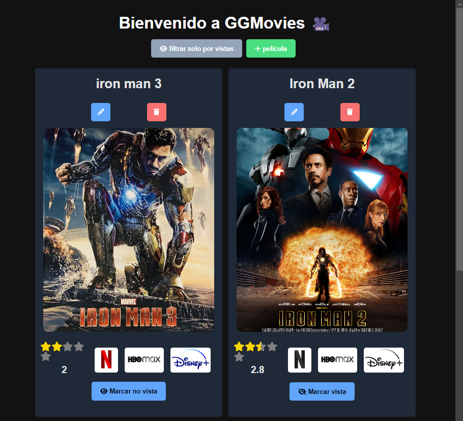
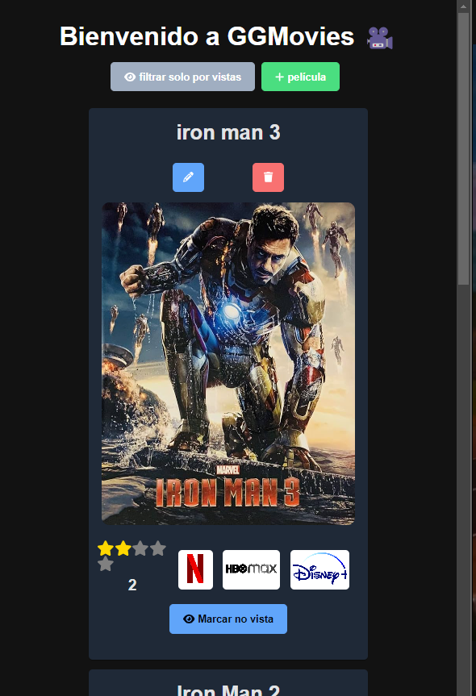
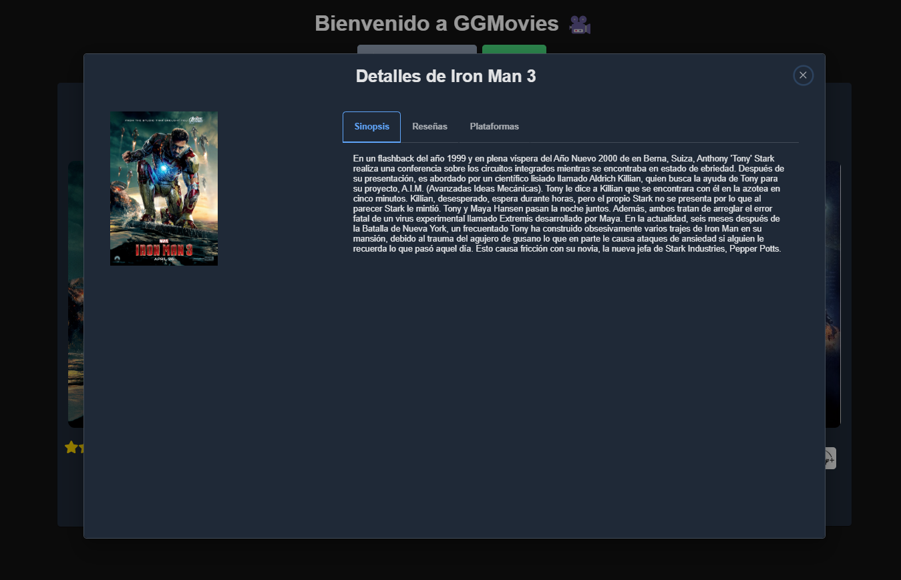
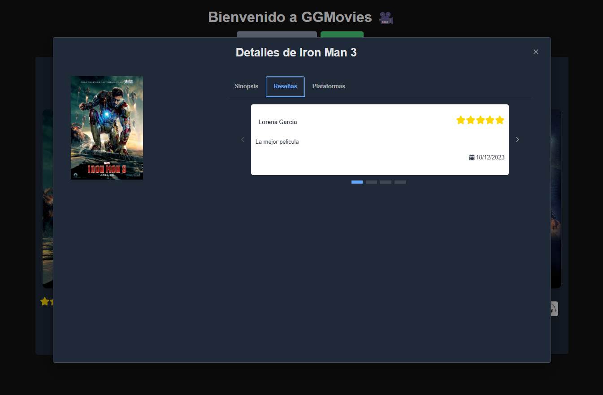
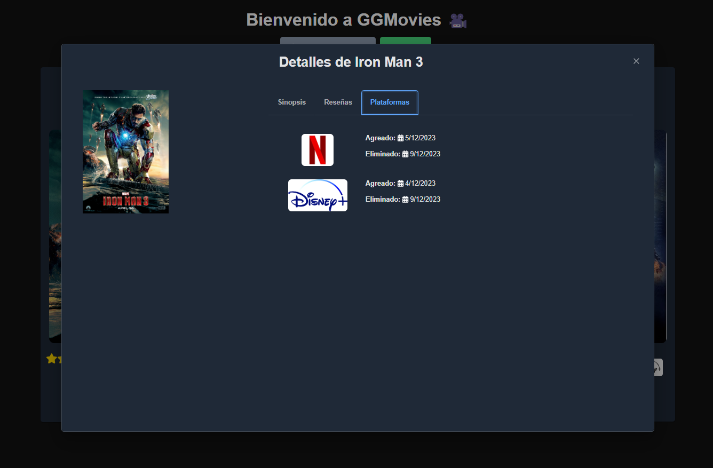
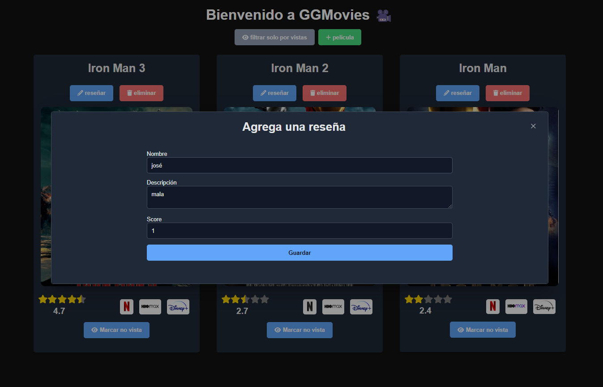
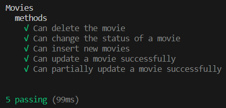

<h1 align="center">
  🎥 GGMOVIES API 🎥
</h1>

<table border="0">
  <tr>
    <td align="center">
      GGMovies API is a Meteor application featuring a graphical interface and implementing multiple Meteor methods, all rigorously tested. Additionally, an Express-based RESTful API has been seamlessly integrated into the Meteor app, enabling external clients to interact with the Movies collection.
    </td>
    <td align="center"> 
        
      </a>
    </td>
  </tr>
</table>

## Table of Contents

1. [Model](#model)
2. [Architecture](#architecture)<br>
  2.1. [Main Technologies](#main-technologies)<br>
  2.2. [Styles and Components Libs](#styles-and-components-libs)<br>
3. [Quickstart for Local Execution](#quickstart-for-local-execution)
4. [Screenshots](#screenshots)
5. [Unit Testing](#unit-testing)
6. [Important Dependencies](#important-dependencies)
7. [RESTful API](#restful-api)<br>
  7.1. [Endpoints](#endpoints)

## Model
The application model consists of 3 collections of documents: movies, platforms, and reviews. The reviews and platforms collections were added to enrich the model, but due to time constraints, they only have read endpoints in the API.


## Architecture
The core of the application is built in Meteor, taking advantage of its full-stack framework feature. It includes a NoSQL MongoDB database, collections in Meteor's own backend to manage the model, and a React frontend tightly integrated with Meteor. Additionally, to meet the requirements of the technical test and increase the diversity of technologies implemented during the test, the CRUD operations for Movies were developed in an Express API.

### Main Technologies

[MeteorJS](https://www.meteor.com/)<br>

[Express.js](https://expressjs.com/)<br>

[NoSQL - MongoDB](https://www.mongodb.com/es)<br>

[React](https://es.react.dev/)<br>

### Styles and Components Libs

[FontAwesome](https://fontawesome.com/)<br>

[Primereact](https://primereact.org/)<br>

## Quickstart for Local Execution

1. Clone project using `git clone https://github.com/Etherion99/GGMovies`.
2. Install Meteor with `npm install -g meteor`.
3. Install dependencies with `meteor npm install`.
4. Run using `meteor run`.

**Note:** Executing these steps automatically starts the Express API.

## Quickstart for Local Execution (Docker)

1. Clone project using `git clone https://github.com/Etherion99/GGMovies`.
2. Install Meteor with `npm install -g meteor`.
3. Install dependencies with `meteor npm install`.
4. Create image and run container using `npm run docker:build-start`.

## Screenshots
<table border="0">
  <tr>
    <td align="center" colspan="2">
         
    </td>
  </tr>
  <tr>
    <td align="center">
         
    </td>
    <td align="center">
         
    </td>
  </tr>
  <tr>
    <td align="center">
        
    </td>
    <td align="center">
         
    </td>
  </tr>
  <tr>
    <td align="center">
         
    </td>
    <td align="center">
        
    </td>
  </tr>
</table>

## Unit Testing

1. Run `meteor npm test`


## Important Dependencies

- **fontawesome:** is a library that provides scalable vector icons that 
can be customized and styled using CSS, enhancing visual design and 
user interface elements in web development.

- **PrimeReact:** is a UI component library for React applications. 
It provides a set of customizable and responsive components that 
enable developers to build modern and visually appealing user interfaces.

- **Express:** is a web application framework for Node.js 
that simplifies the process of building robust and scalable web applications 
by providing a set of powerful features and tools.

- **Hapi/Boom:** is a utility library for handling HTTP errors in Node.js applications, 
simplifying the process of creating and formatting error responses.

- **cors:** The `cors` npm package is a middleware for Node.js web applications. It enables Cross-Origin Resource Sharing (CORS) support by allowing or restricting HTTP requests from different origins. This package helps handle CORS headers, making it easier to configure and manage cross-origin requests in a Node.js application.

- **Joi:** is a JavaScript library for validating and defining the structure of objects. 
It's commonly used in Node.js applications for input validation.


## RESTful API
This API was developed in Express and is documented in [Postman](./docs/Movies.postman_collection.json)

### Endpoints

- http://localhost:3000/api/v1/movies : This endpoint returns all movies from the database when you make a GET request.
- http://localhost:3000/api/v1/movies/sortCreateAt : This endpoint returns the details of a movie by providing its Id. 
- http://localhost:3000/api/v1/movie : This endpoint enables the creation of a movie by sending an object in the request body, as illustrated below.
```
{
    "title": "title test postman 3",
    "synopsis":
      "synopsis test postman",
    "image":
      "https://cdn.europosters.eu/image/750/posters/iron-man-one-sheet-i3287.jpg",
    "score": 3.75,
    "platforms": [
      {
        "id": "3wJbAH6mht4E8jn4K",
        "name": "netflix",
        "logo": "https://cdn4.iconfinder.com/data/icons/logos-and-brands/512/227_Netflix_logo-512.png",
        "addedAt": 1702128114,
        "deletedAt": 1702129114
      },
      {
        "id": "9dYF2rdWNsRjp3Jz5",
        "name": "HBO Max",
        "logo": "https://1000marcas.net/wp-content/uploads/2022/05/HBO-Max-Logo.png",
        "addedAt": 1702128114,
        "deletedAt": 1702129114
      }
    ],
    "isWatched": false,
    "reviews": [
      {
        "user": "user 1",
        "description": "la mejor película que he visto",
        "score": 4,
        "createdAt": "2023-12-14T17:57:03.654Z"
      },
      {
        "user": "user 2",
        "description": "la peor película que he visto",
        "score": 2,
        "createdAt": "2023-12-14T17:57:03.654Z"
      },
      {
        "user": "user 3",
        "description": "no la volvería a ver",
        "score": 1,
        "createdAt": "2023-12-14T17:57:03.654Z"
      }
    ]
  }
```
- http://localhost:3000/api/v1/movie/:id : This endpoint allows the update of any attribute of a movie by providing its id.

- http://localhost:3000/api/v1/movie/setIsWatched/:id : This endpoint modifies the viewing status of a specific movie by updating the "isWatched" property using its id.

- http://localhost:3000/api/v1/movie/:id : This endpoint deletes a movie by providing its id.

## Important Security and Integration Considerations

* The removal of the "insecure" and "autopublish" packages was a crucial measure to enhance the application's security. This decision was made with a future-oriented perspective, taking into account the scalability of the platform and advanced user management. By doing so, a solid foundation is established for more robust and controlled implementations, laying the groundwork for the ongoing growth and evolution of the application.

* The `Meteor.bindEnvironment` function is being used in the movies service (movies.service) of an Express application with Meteor to manage Fiber context during asynchronous operations. In an Express application using Meteor, this approach ensures that asynchronous operations related to movies are properly bound to the Meteor execution environment. This is crucial when communicating with Meteor functions that depend on Fiber, preventing issues associated with the loss of execution context. In summary, by using `Meteor.bindEnvironment` in the movies service, it ensures the consistent and predictable execution of asynchronous operations within the Meteor environment, avoiding errors related to asynchrony.

## comentarios de la prueba técnica

* La integración de Meteor con la API de Express para aprovechar la BD Mongo integrada en Meteor se realizó solo con fines demostrativos para poder cumplir los criterios de documentación de la API sin perder la oportunidad de implementar Meteor.

* Las pruebas unitarias corren sobre los métodos de Meteor.

* El eslint está configurado sobre la API Express.

* La API de Express se documentó con Postman y se adjuntó el collection [aquí](./docs/Movies.postman_collection.json).

* La Aplicación (incluyendo Meteor y Express) fue desplegada en conjunto sobre una máquina AWS [aquí]().

* La aplicación cuenta tanto con API como con una interfáz en React suficiente para probar un CRUD básico con las siguientes operaciones:
  * listar películas
  * listar plataformas
  * agregar películas
  * eliminar películas (hace falta un modal de confirmación de eliminación que se omite por motivos de tiempo)
  * agregar reseñas (al agregarla los datos de agregado y eliminado se llenan de forma automática)
  * marcar película como vista
  * actualizar películas (solo disponible por API, aunque al marcarla como vista o agregar reseñas técnicamente se está actualizando).

* Para aprovechar al máximo el recorrido por la interfaz se reocmienda dar click en el poster de alguna película para ver más detalles sobre esta y utilizar el filtro de peliculas vistas en la parte superior de la interfaz.

* La primera vez que ejecutes la aplicación Meteor se llenará automáticamente la BD con datos de prueba, para volver a poblarla es necesario eliminar la BD de Mongo y volver a correr el proyecto (puedes ver la url de Mongo con el comnado `meteor mongo --url`).

* Por cuestión de tiempo la API de Express está resumida al modelo peícula unicamente pero dispone de una validación mediante esquemas con Joi.